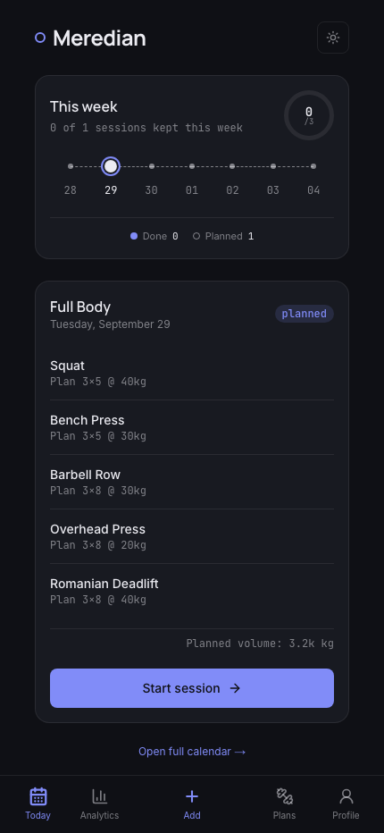
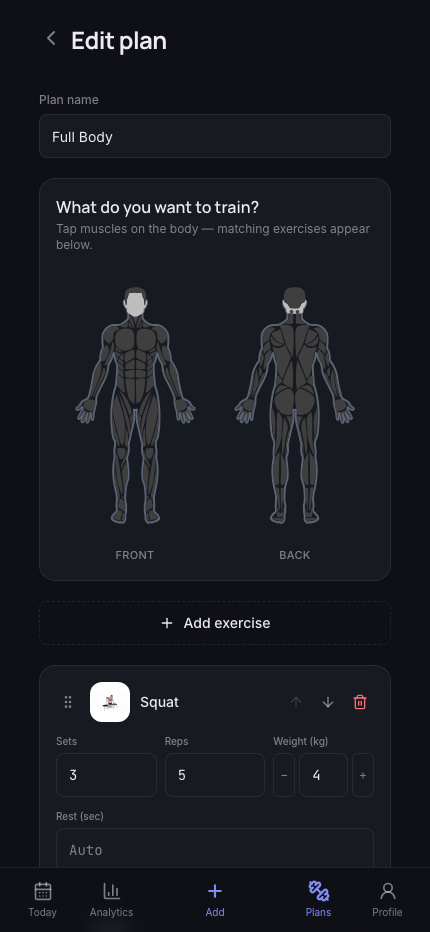
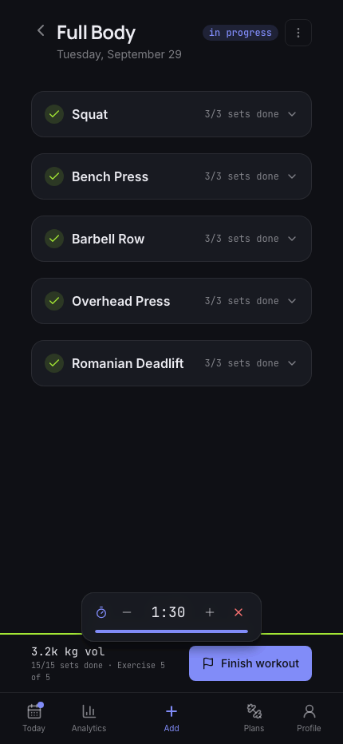
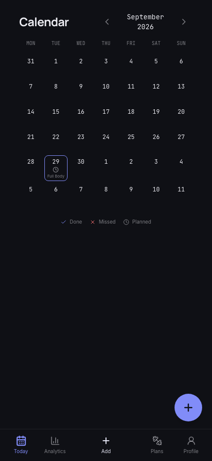
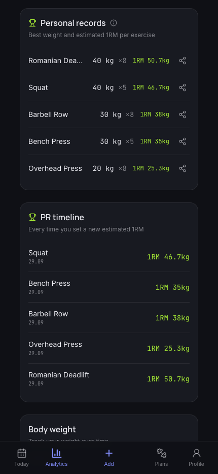

# Meredian - Train with precision

A workout planning and tracking app I built mostly to learn how a "real" full-stack
app fits together: auth, a Postgres database with row-level security, server
actions, i18n, a PWA that works offline, all of it in one project instead of
scattered tutorials. It's also just the training app I actually wanted: plan a
session, log what I really did, and see the gap between the two over time instead
of guessing.

Live at [meredian.fit](https://meredian.fit). It's a personal project, so expect
a rough edge here and there.

## What it does

- Build workout plans exercise by exercise. There's a body map to tap muscle
  groups and a recommendation engine that suggests sets/reps/rest based on your
  training level, so you're not starting from a blank form.
- Schedule sessions on a calendar, one-off or recurring.
- Log a session set by set with a rest timer, then Meredian shows you plan vs.
  what you actually did, and that comparison is really the whole point of the app.
- Analytics: a consistency heatmap, progress charts, personal records with
  estimated 1RM, muscle balance by volume, body weight over time.
- Share a plan with a public link, get push notifications for today's session,
  export your data, install it as an offline-capable PWA.
- English, Spanish, Norwegian, Russian, and Ukrainian.

## Screenshots

<p>
  
  
  
</p>
<p>
  
  
</p>

## Stack

- **Next.js** (App Router, Server Actions) + TypeScript, strict mode
- **Supabase** (Postgres, Auth, Row Level Security)
- **Tailwind CSS** + Radix UI primitives
- **Recharts** for the analytics charts, **Framer Motion** for the small
  animations
- **next-intl** for i18n, **Zod** for validation
- **Vitest** for tests, **GitHub Actions** for CI and for auto-pushing
  migrations on merge

## Running it locally

```bash
npm install
cp .env.example .env.local   # fill in your own Supabase project details
npm run dev
```

You'll need a Supabase project of your own. Create one at
[supabase.com](https://supabase.com), then run the SQL files in
`supabase/migrations/` in order through the Supabase SQL editor (locally there's
no CLI push, that's only wired up for the deployed app in CI).

Useful scripts while working on it:

```bash
npm run typecheck
npm run lint
npm run test
```

## Project layout

```
app/
  (auth)/        login, signup, password reset
  (app)/         dashboard, calendar, plans, session, analytics, profile
  actions/       server actions (the actual data-mutation layer)
components/      feature-grouped React components + a small ui/ design system
lib/
  supabase/      client factories (browser, server, middleware)
  data/          server-only data readers
  validation/    zod schemas
  utils/         units, dates, insights, recommendations
supabase/
  migrations/    plain SQL, applied in order
  functions/     the push-reminders edge function
```

## License

MIT. See [LICENSE](LICENSE).
